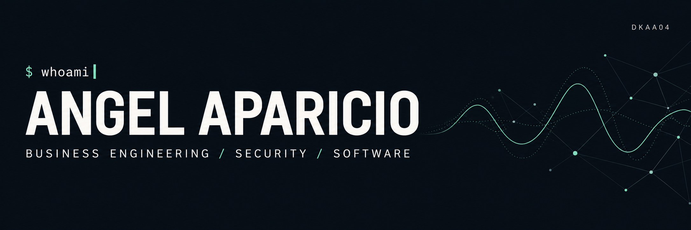
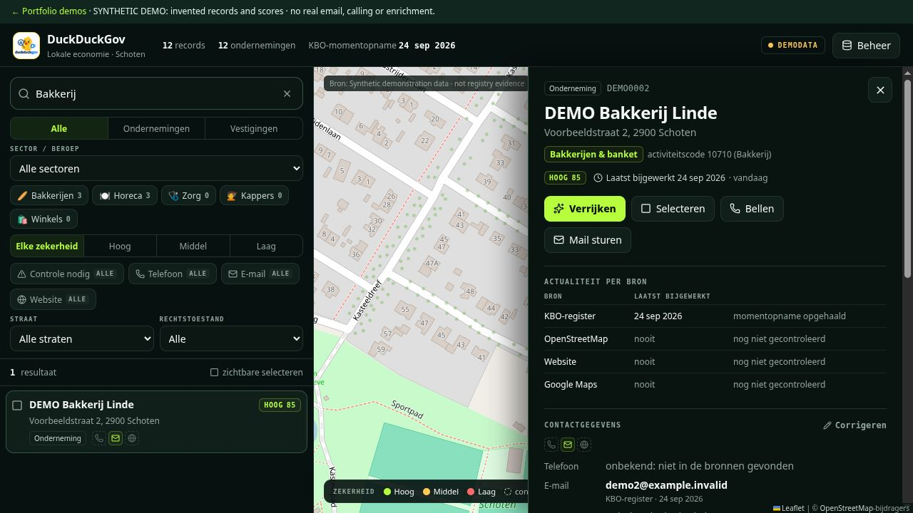
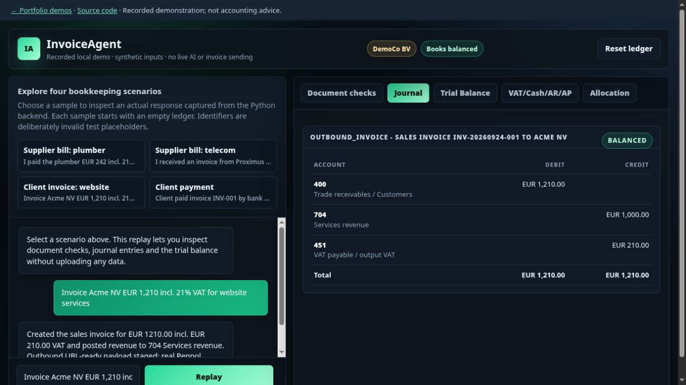
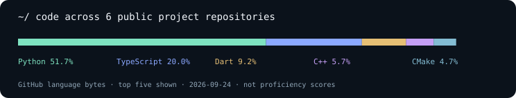
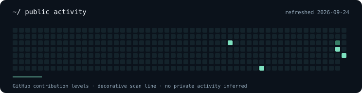

<p align="center"></p>

<p align="center">
  <a href="https://dkaa04.github.io/DKAA04/">Open interactive demos</a> ·
  <a href="https://github.com/DKAA04?tab=repositories">Browse repositories</a>
</p>

## ~/ whoami

```text
Angel Aparicio Pastor
Business Engineering · KU Leuven · Business & Information Systems
Expected graduation: 2027

Building:   data tools, AI-assisted workflows and practical automation
Direction:  cybersecurity, backed by software and business understanding
Learning:   penetration testing and adversary emulation
```

I like turning messy information into tools people can inspect and use. My work spans municipal data exploration, invoice processing, vibration-signal classification and operational automation.

**2nd place · Code the Sky Hackathon (2026).** PNPT and CRTO preparation is in progress; these are not completed certifications.

## ~/ selected-work

### 01 · [DuckDuckGov](https://github.com/DKAA04/Hackathon-16-9)

A map-based interface for investigating business-register records, with search, filters, source evidence and manual review. **React · TypeScript · FastAPI · SQLite**

<a href="https://dkaa04.github.io/DKAA04/duck.html"></a>

[Try the synthetic demo →](https://dkaa04.github.io/DKAA04/duck.html) · [Architecture & setup](https://github.com/DKAA04/Hackathon-16-9#readme)

The public demo runs the existing interface with invented records. External enrichment, email sending and calls are disabled. The full repository documents the registry-data prototype and optional integrations.

### 02 · [InvoiceAgent](https://github.com/DKAA04/Stripe_hackathon_Einvoicing)

From short invoice descriptions to account allocations, VAT calculations and double-entry journals. Optional AI handles interpretation; Python handles the monetary logic. **Python · FastAPI · PyMuPDF · optional Gemini**

<a href="https://dkaa04.github.io/DKAA04/invoice.html"></a>

[Explore the recorded demo →](https://dkaa04.github.io/DKAA04/invoice.html) · [Implementation & tests](https://github.com/DKAA04/Stripe_hackathon_Einvoicing#readme)

Four synthetic examples captured from the real Python backend. This is an interactive replay, with no live AI, uploads or invoice transmission. The application remains a hackathon prototype.

### 03 · [Code the Sky](https://github.com/DKAA04/CODE-THE-SKY_CLEAN-REPO)

**2nd-place hackathon project.** Exploring bolt-condition classification through vibration signals, FFT features and different train/test split strategies. **Python · SciPy · scikit-learn · Streamlit · BigQuery ML**

[Explore the signal pipeline →](https://github.com/DKAA04/CODE-THE-SKY_CLEAN-REPO#readme)

The README distinguishes historical results from reproducible evidence. The raw dataset and trained model are not distributed in the public repository.

### 04 · [Email & Product Lookup Automation](https://github.com/DKAA04/internship-email-system)

Focused Python modules for parameterized database lookup and AWS SES delivery, including attachments, retries and a mocked delivery test. **Python · MySQL · AWS SES**

[Read the implementation →](https://github.com/DKAA04/internship-email-system#readme)

## ~/ toolbox

Tools used in the public projects, rather than proficiency ratings:

| Build | Work with data | Interface |
| --- | --- | --- |
| Python · FastAPI · Git | SQL · pandas · NumPy · SciPy | TypeScript · React · Vite |
| SQLAlchemy · MySQL · AWS SES | scikit-learn · BigQuery ML | Streamlit · Flutter · Dart |

## ~/ public-activity




Graphics use public GitHub data and display their refresh date. [How the visuals and demos are produced](SOURCE_NOTES.md).

<sub>I’m consolidating and documenting projects from my development environments. These repositories include hackathon and learning prototypes; each README explains what works, how to run it and what still needs validation.</sub>
